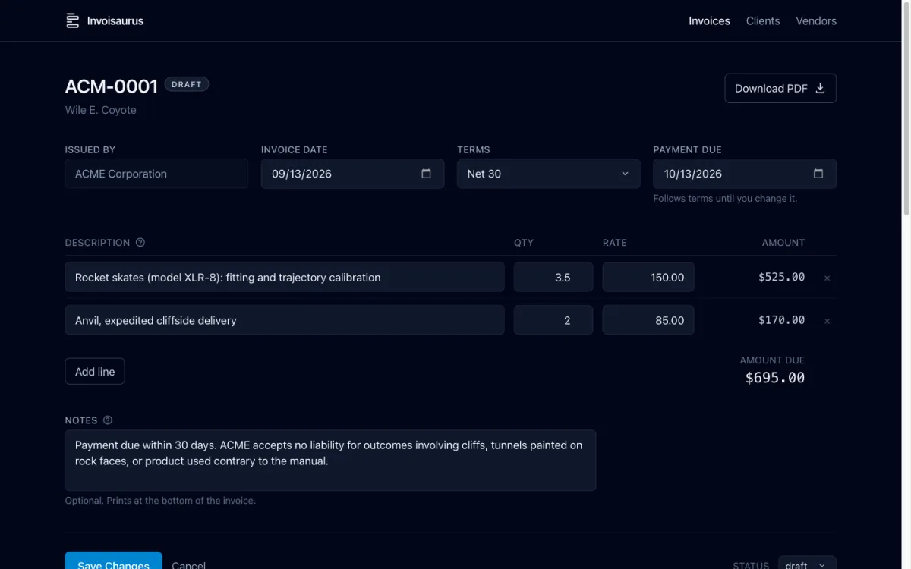
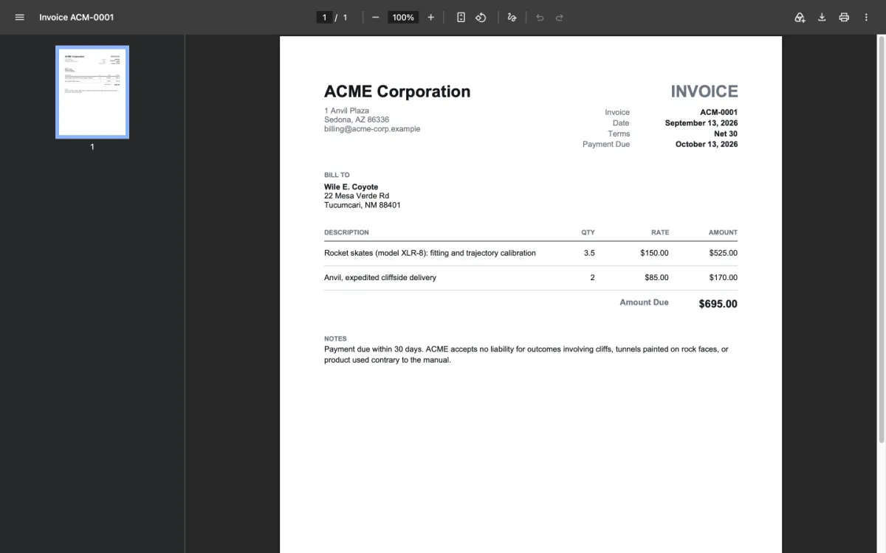
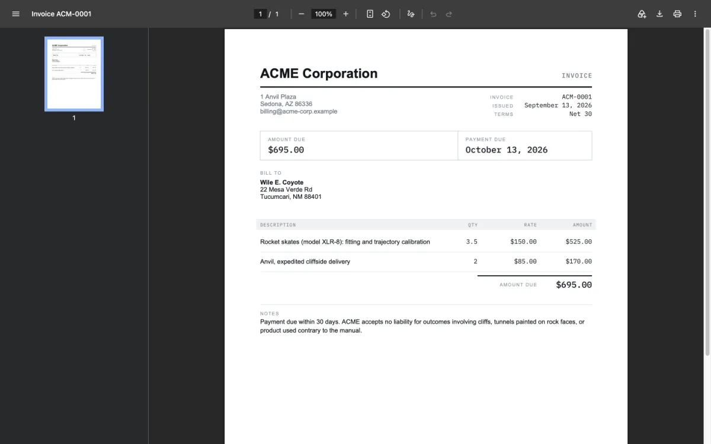

# Invoisaurus

Invoice generator. Web UI in, PDF out.

Built to replace a hosted invoicing product whose UI was slow and whose site was
down during an actual billing attempt. The local tool runs on your machine,
stores plain JSON, and generates the PDF you send to the client. It needs no
account, no network and no database, and the server binds loopback only, so an
editor with no login on it does not appear on whatever network the machine has
joined.

The same code is also a package. The routes, the record rules and the PDF
engine are built by a factory that takes its store, its mount point and its
chrome as arguments, so a host of your own can put accounts, a database and
billing around them without editing a route. See [Use as a package](#use-as-a-package).



Line-item arithmetic happens in the browser as you type. Everything else is a
form POST. The preview below the editor is not a second rendering of the same
data — it is an iframe pointed at the real PDF route, so what you see is the
file the client gets.



## Quick start

Needs [Node](https://nodejs.org) 22.6 or newer. Nothing else.

```sh
git clone https://github.com/centricle/invoisaurus.git
cd invoisaurus
npm run setup
npm run dev
```

Then open <http://localhost:7054>.

`npm run setup` installs dependencies, builds the stylesheet, and seeds a demo
vendor, client and invoice so there is something to look at. It is safe to
re-run.

On Windows, or if you would rather not run the script, do the same three things
by hand, then start it:

```sh
npm install
npm run css:build
npm run seed
npm run dev
```

The CSS build is not optional. The compiled stylesheet is generated rather than
committed, so a fresh clone that skips it runs fine but renders every page
unstyled.

## Seed data

Named for `npm run seed`, which puts sample records in your own data directory.
Not to be confused with [Demo mode](#demo-mode) below, which is the hosted,
writes-nothing mode.

The seed creates three fictional records:

| Record | Value |
|---|---|
| Vendor | ACME Corporation, invoice prefix `ACM-` |
| Client | Wile E. Coyote |
| Invoice | `ACM-0001`, draft, $695.00 |

**Removing them:**

```sh
npm run seed -- --remove
```

That clears the vendor, the client and the invoice, leaving an empty data
directory ready for your own records. It refuses to run if the directory
contains anything that is not demo data, so it cannot eat real invoices. If it
refuses, delete the demo records by hand or point `INVOISAURUS_DATA_DIR` somewhere
new.

You can also just delete the data directory. The app recreates it empty on the
next start, so that is a clean slate rather than a repair.

One thing worth knowing before you start numbering for real: **invoice numbers
are never reused within a vendor's lifetime.** Delete `ACM-0003` and the next
invoice is still `ACM-0004`. A gap in the series is a voided invoice; a
duplicate is an accounting problem. Removing the demo vendor entirely does reset
the counter, because the counter lives on the vendor record. The guarantee holds
within one running app: two processes writing the same data directory at once
are not coordinated, so run one at a time.

## Importing line items

If the hours already live in a spreadsheet, export them as CSV and create the
invoice from that instead of retyping each line:

```sh
npm run import -- august.csv --client wile-e-coyote --notes "Services rendered in August."
```

One CSV makes one draft invoice. The file needs a header row naming three
columns, in any order, matched without regard to case:

```csv
description,quantity,rate
"**Rocket skates**
Fitting and trajectory calibration.",3.5,150.00
Anvil delivery,2,$85
```

`qty` works in place of `quantity`, and any other columns are ignored. A
description can span lines and use the [formatting](#formatting) the editor
supports; wrap it in double quotes, and write a quote inside it as `""`.
Quantities and rates are read by the same code as the editor's fields, so
`$1,250.00` and `7.5` both work.

| Option | Default | |
|---|---|---|
| `--client <id>` | none | Required. The id is in the client's edit URL |
| `--vendor <id>` | the only vendor | Required once there is more than one |
| `--date YYYY-MM-DD` | today | Issue date |
| `--terms <id>` | `net30` | `on-receipt`, `net15`, `net30`, `net45`, `net60` |
| `--notes <text>` | empty | Notes, on every invoice the command creates |
| `--dry-run` | | Validate and print totals, write nothing |

Several files can be named at once; they are numbered in the order given.
Everything is checked before the first number is used. An invoice number is
taken from the vendor's counter at the moment the invoice is written, and it is
not given back if a later write fails, so importing file by file would leave a
gap in the series behind a typo in the second file. Instead, one bad row stops
the whole command with every problem listed, and nothing is written.

Imported invoices are drafts. Open one in the app to check it, then mark it
sent.

## Demo mode

There is a second way to run this, used for the
[public demo](https://centricle.com/etc/invoisaurus/): every browser
session gets its own set of records, held in memory and seeded with the ACME
cast, and **nothing is written to disk at all.**

```sh
npm run demo
```

Then open <http://localhost:7055/invoices>. It runs on its own port so it can
sit alongside `npm run dev` rather than replacing it, and it points
`INVOISAURUS_DATA_DIR` at a path that does not exist, so it cannot reach your
real invoices even by accident.

What is different from the normal app:

- Records live in memory, per session. Two browsers see two different sets, and
  closing the tab is a reset. A **Reset demo** button in the banner does the
  same thing on purpose.
- The seed is larger: five invoices across three clients, covering every status
  including one that is overdue, so the list screen has something to show.
- Generated PDFs carry a diagonal `DEMO` watermark. They are otherwise the real
  thing, produced from whatever you typed by the same code the local tool uses.
- A banner and a `DEMO` badge appear on every page.

Everything else is the same code. Every request carries the store its handlers
read from, and in demo mode that is the visitor's own, held in memory. The
routes never branch on the mode, so validation, invoice numbering, the snapshot
freeze and the PDF are all the ones described above.

### Serving it under a path prefix

The hosted demo lives at a subpath of another site, so the app can be mounted
under a prefix:

```sh
npm run demo -- --base=/etc/invoisaurus
```

Every link, form action, asset URL, redirect and cookie path shifts to match.
The bare root then returns 404, which is correct. The app is at
`/etc/invoisaurus/invoices`. `BASE_PATH` is empty by default and the local tool
never needs it.

### The hosted build

`netlify.toml` describes the deployment: the Express app runs as a single
Netlify function, and `public/` is staged into `dist/` so the CDN serves the
static assets.

**Nothing in it is specific to this project's own site.** Point a Netlify
project at a fork and you get a working demo at the root of your own domain,
configuring nothing. Demo mode is asserted by the function rather than left to
an environment variable, because a public deploy of this that *wasn't* in demo
mode would be an unauthenticated invoice editor writing to a read-only disk.

To serve it under a path prefix instead, set `BASE_PATH` as a project
environment variable rather than editing the repo:

```sh
netlify env:set BASE_PATH "/some/prefix"
netlify env:set ALLOW_ORIGINS "https://example.com"
```

That reaches both the build, which stages the assets into a matching directory,
and the function at runtime. A variable set in `netlify.toml`'s
`[build.environment]` would reach only the build, and the app would then serve
at the root while its assets sat one directory down. `ALLOW_ORIGINS` names the
site the browser actually sees, for the form-post check described under
[Design](#design); a current browser passes that check without it.

To reproduce the build the way CI runs it:

```sh
npx netlify build
npm run check:bundle
npm run smoke:bundle
```

`smoke:bundle` unzips the function archive and calls its handler the way Lambda
would, for the invoice list and three PDFs. The suite runs the source, but the
bundler rewrites it into CommonJS on the way out, and 2.0.0 shipped a demo whose
every PDF was a 500 with the whole suite green: a default export came back as a
module namespace once transpiled, and nowhere else. Every module under `src/`
now uses named exports, a test refuses a default one, and this script is what
would have caught it anyway.

`check:bundle` inspects the generated function archive and fails if it contains
anything private. That is not paranoia: the bundler traces file paths out of the
source and once packaged the entire `data/` directory, real invoices included,
because a default path in `src/config.js` pointed at it. `.gitignore` governs
git, not the bundler, so a clean repo says nothing about what ships. CI builds
from a fresh clone where `data/` does not exist; a local deploy is where this
matters.

## Design

**Your data is not in this repo.** The application reads and writes an external
directory (`INVOISAURUS_DATA_DIR`, default `./data`, gitignored). Keep it wherever
you like, back it up however you like. Nothing in it can be rebuilt from this
repo, so if that directory goes, the invoices go with it.

**Money is integer cents, quantities are integer thousandths.** JavaScript has
one number type and it stores fractions in binary. Decimal values like 0.1 have
no exact binary form, the same way 1/3 has no exact decimal form, so every
operation carries a small error: `0.1 + 0.2` evaluates to `0.30000000000000004`.
Round a column of those into a total and the invoice is off by a cent from the
sum the client adds up by hand. Integers have no such gap, so a rate of $150.00
is stored as `15000` and converted back to dollars only when it is printed.

**Invoices snapshot, they do not reference.** Each invoice freezes the vendor
and client details as they were when it was issued. Editing a client's address
never alters a past invoice, because an invoice is a record of what was sent.

**Invoice numbers are per-vendor.** The number is the issuing entity's book.
Each vendor carries its own prefix, padding and counter.

**A form post has to prove where it came from.** Any page on the internet can
make a browser submit a form to any address, cookies attached. Locally that is
moot, but hosted, the same handlers are a public write surface. So every request
that changes something is checked: a current browser's own `Sec-Fetch-Site` and
`Origin` headers settle it, and a client that sends neither has to echo a token
the page carried in a hidden field, from a cookie another site cannot read. A
request that fails gets a page explaining what to do, not a silent save of
nothing. `src/csrf.js` has the mechanism.

### Two styles

Every invoice is drawn in one of two styles, chosen per invoice from the buttons
above the preview. **Classic** is Helvetica throughout, hairline rules, no fills.
**Modern** keeps Helvetica for anything read in sentences and sets the labels,
dates and every figure in IBM Plex Mono, with a summary panel carrying the amount
due and the date it is due. Both use the same page box and the same columns, so
one reads against the other line for line.



A vendor carries the style its new invoices start in; changing it leaves invoices
already issued alone. The style freezes when an invoice leaves draft, alongside
the address blocks and for the same reason: the client already has a PDF drawn one
way, and redrawing that invoice number another way turns one number into two
different-looking documents.

Modern embeds two faces of IBM Plex Mono, which live in `src/lib/pdf/fonts/` under
the SIL Open Font License 1.1 (`OFL.txt` sits beside them). They are shipped
exactly as IBM released them rather than subset down: pdf-lib subsets again at
embed time, so the document a client receives is within about a hundred bytes
either way, and subsetting here would drop the license notice out of the file and
leave a derived binary that cannot be regenerated without a Python toolchain.
A Modern invoice runs roughly 9 KB larger than a Classic one.

### Formatting

A line-item description and the notes block accept a small formatting subset.

| Type this | Get this |
|---|---|
| `# Heading` | a bold heading, one size up |
| `**bold**` or `__bold__` | bold |
| `*italic*` or `_italic_` | italic |
| `- item` | a bulleted list |
| `1. item` | a numbered list, renumbered from the number you start with |
| `\*` | a literal asterisk |

**Everything else prints as you typed it.** There is one heading level, lists do
not nest, and `*` at the start of a line is emphasis rather than a bullet. A
marker with no closing partner is just a character, so `2 items * 3 crates` is
arithmetic and `file_v2_final.pdf` is a filename.

This is a subset of CommonMark rather than a dialect of it, with one deliberate
difference: **a line break is a line break.** CommonMark folds consecutive lines
into one paragraph. Here each line prints where you put it, because that is what
the field did before any of this existed.

**An invoice keeps the rules it was written under.** Every record carries a
schema version, and one written before this feature renders as plain text
forever, asterisks and all. Re-rendering a document you sent last year has to
produce the document you sent, not today's reading of it. Editing such an
invoice does not change that either, so nothing is reinterpreted behind your
back.

## Configuration

| Variable | Default | Effect |
|---|---|---|
| `INVOISAURUS_DATA_DIR` | `./data` | Where records are read and written |
| `PORT` | `7054` | Port the server listens on |
| `NODE_ENV` | unset | `production` enables template caching |
| `DEMO_MODE` | unset | `true` runs [demo mode](#demo-mode): in-memory records, nothing written |
| `BASE_PATH` | empty | Serve the app under a path prefix, e.g. `/etc/invoisaurus` |
| `ALLOW_ORIGINS` | empty | Comma-separated origins a browser may post from, when the app is proxied under another site |
| `INVOISAURUS_ROOT` | derived | Where the app's own files are. Only needed when bundling, which strips `import.meta` |

`DEMO_MODE` is compared against the exact string `true`, so a stray
`DEMO_MODE=false` cannot put a real installation into a mode where its saves
silently go nowhere.

All of them are read at startup. To run against a different data directory on a
different port:

```sh
INVOISAURUS_DATA_DIR=~/Documents/invoices PORT=3000 npm run dev
```

## Your data

The data directory holds three things:

```
vendors.json              one entry per issuing entity
clients.json              one entry per client
invoices/ACM-0001.json    one file per invoice
```

Plain JSON, one record per file for invoices, human-readable and greppable
without the app. Writes are atomic (temp file plus rename), so an interrupted
save cannot leave a half-written invoice.

If a file in `invoices/` will not parse, or parses into something that is not an
invoice, the list names it and marks it unreadable rather than either hiding it
or refusing to render. One damaged file should not conceal the other two
hundred, and an invoice that quietly stops appearing is an invoice nobody
chases. The two registry files are the exception: they fail loudly, because
every invoice on disk points into them.

Backing it up is up to you. `npm run data:commit` exists for one specific setup:
a data directory that is itself a git repo. It stages and commits everything in
one step. Point it at a directory that is not a repo and it commits nothing and
exits with an error saying how to initialize one. Any other backup approach, or
none, works the same as far as the app is concerned.

## Tests

```sh
npm test
```

Node's built-in runner. No test dependencies, no config, no watch mode to learn.

Every test file binds `INVOISAURUS_DATA_DIR` to a fresh temporary directory before
it loads anything from `src/`, so the suite cannot reach your records even by
accident. `test/routes.test.js` runs the real Express app against one of those
directories on an ephemeral port, so the request handlers are covered too, not
just the pure functions underneath them.

`test/store-contract.js` is the store contract: one script of creates, renames,
allocations, saves and deletes, run against a store and compared line by line
with a recorded answer key. Both stores in this repository answer it, and a
store written elsewhere can import it as `invoisaurus/testing` and be held to
the same key.

`.github/workflows/test.yml` runs the same command on pushes to `main` and on
every pull request, against the Node version pinned in `.nvmrc`.

## Project layout

| Path | Purpose |
|---|---|
| `server.js` | Entry point: reads the environment and builds the local tool or the demo |
| `src/app.js` | `createApp()`: the routes, views and middleware, as a function of options |
| `src/config.js` | What the entry point reads from the environment |
| `src/paths.js` | Where this package's own templates, assets and fonts are |
| `src/schema.js` | Record shapes and validation. The single definition of the data model. |
| `src/store.js` | `createJsonStore()`: record rules over a directory. Atomic writes, number allocation, the create/update split |
| `src/storage.js` | Where those records physically live. Filesystem by default |
| `src/storage-memory.js` | The in-memory backend the demo uses |
| `src/demo.js` | `createGuestSessions()`: a store per visitor, and the reset |
| `src/seed.js` | Populates any store with the ACME cast, through the store's own methods |
| `src/import.js` | CSV parsing, and line items from a CSV |
| `src/csrf.js` | The form-post check |
| `src/cookies.js` | Reads one cookie. Used by the flash, the demo and the check above |
| `src/fixtures/acme.js` | The ACME cast, shared by the seeder and the demo |
| `src/money.js` | Integer-cent arithmetic and formatting |
| `src/lib/markup.js` | The formatting subset, text to blocks. Knows nothing about PDFs |
| `src/lib/pdf/` | `layout.js` holds the geometry, `richtext.js` turns blocks into lines, `generate.js` paginates and paints |
| `src/lib/pdf/styles/` | One module per invoice style. What a page looks like, as lists of draw operations |
| `src/lib/pdf/fonts/` | IBM Plex Mono, embedded by the Modern style, under the OFL |
| `src/routes/` | One router each for invoices, clients, vendors |
| `src/views/` | EJS templates |
| `public/js/` | Browser-side behavior: the invoice editor, the number steppers on the vendor and invoice forms, and the formatting help popover |
| `netlify/` | The hosted demo: one function wrapping the same Express app |
| `netlify.toml` | How that deploy is built and routed |
| `test/store-contract.js` | The store contract and its answer key, exported as `invoisaurus/testing` |

Express 5, EJS, Tailwind 4 via the CLI, pdf-lib. Line-item arithmetic is vanilla
JS in the browser; everything else is a form POST. No bundler, no client
framework, five runtime dependencies. `@pdf-lib/fontkit` is what lets the Modern
style embed a font file, and `serverless-http` is used only by the hosted demo.

## Use as a package

```sh
npm install invoisaurus
```

The smallest working host is the one the tests use:

```js
import { createApp } from 'invoisaurus';
import { createJsonStore } from 'invoisaurus/store';
import { createMemoryBackend } from 'invoisaurus/memory';

const store = createJsonStore({ backend: createMemoryBackend(), dataDir: '/records' });
await store.ensureDataDir();

const app = createApp({
  store,                     // or attach req.store in middleware, per request
  basePath: '',              // or '/etc/invoisaurus'
  middleware: [],            // runs after static files, before the routers
  home: true,                // GET / redirects to the invoice list
  allowOrigins: [],          // proxies a browser may post from
  locals: {},                // defaults for the chrome: banner, badge, navRight, footer
  mount(app, { u }) {},      // extra routes, added before the 404 handler
});
app.listen(7054, '127.0.0.1');
```

**The store is the seam.** `createApp` never imports one. A request reads
whatever `req.store` holds, which is either the `store` given here or what a
middleware attached -- a visitor's memory, a directory, a tenant's tables. Any
object that answers the contract in `test/store-contract.js` will do, and
`invoisaurus/testing` exports `assertStoreContract(makeStore)` so a new one can
prove it. Every method is async, including the ones the JSON store answers
synchronously underneath, so a store that has to wait on a database is a
drop-in rather than a rewrite of every caller.

**The chrome has slots, not modes.** Middleware sets `res.locals.banner`,
`badge`, `navRight`, `footer` and `watermark` per request, in the shapes
documented at the top of `src/views/partials/layout-head.ejs`, and the layout
renders what it is given. That is how the demo says "this is a demo" and how a
host says who is signed in, from one set of templates.

**Two things a bundler cannot see.** The templates and the Modern style's font
files are read at runtime, so a serverless bundle has to carry them: list
`node_modules/invoisaurus/src/views/**` and `node_modules/invoisaurus/src/lib/pdf/fonts/**`
in `included_files`, and set `INVOISAURUS_ROOT` to the package directory inside
the bundle, exactly as `netlify/demo-env.js` does for the demo. A host that
keeps the fonts elsewhere passes a loader to `configureFonts` from
`invoisaurus/fonts` instead. The stylesheet is generated, not shipped: build it
from `public/css/app.css` with the Tailwind CLI, pointing `@source` at both
sets of templates.

The rest of the surface -- `invoisaurus/schema`, `/money`, `/markup`, `/import`, `/pdf`,
`/demo`, `/seed`, `/fixtures`, `/csrf`, `/flash`, `/cookies`, `/paths` -- is
the same modules the local tool is made of, under the names in `package.json`.

## License

[AGPL-3.0-only](./LICENSE), from 2.0.0. Copyright 2026 Kevin Smith.

Versions 1.x were released under MIT and remain so; the tags carry their own
license file. The change protects the one thing MIT does not: someone can run
this, change it and host it, but not as a closed service. Running an unmodified
copy for yourself, or a modified one you publish the source of, is exactly what
the license is for.

IBM Plex Mono, in `src/lib/pdf/fonts/`, is licensed separately under the
[SIL Open Font License 1.1](./src/lib/pdf/fonts/OFL.txt) and is shipped unmodified.
