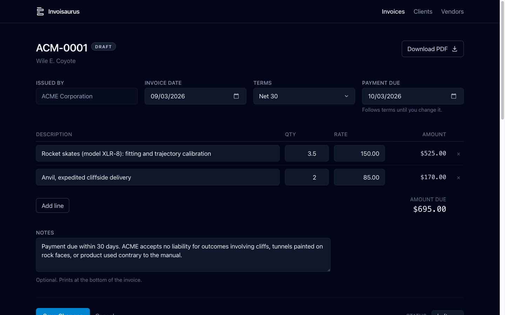
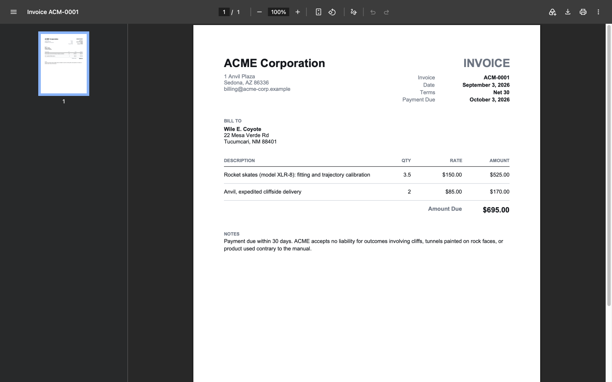

# Invoisaurus

Local invoice generator. Web UI in, PDF out.

Built to replace a hosted invoicing product whose UI was slow and whose site was
down during an actual billing attempt. Runs on your machine, stores plain JSON,
and generates the PDF you send to the client. No account, no network, no
database. The server binds loopback only, so an editor with no login on it does
not appear on whatever network the machine has joined.



Line-item arithmetic happens in the browser as you type. Everything else is a
form POST. The preview below the editor is not a second rendering of the same
data — it is an iframe pointed at the real PDF route, so what you see is the
file the client gets.



## Quick start

Needs [Node](https://nodejs.org) 22.6 or newer. Nothing else.

```sh
git clone https://github.com/centricle/invoisaurus.git
cd invoisaurus
npm run setup
npm run dev
```

Then open <http://localhost:7054>.

`npm run setup` installs dependencies, builds the stylesheet, and seeds a demo
vendor, client and invoice so there is something to look at. It is safe to
re-run.

On Windows, or if you would rather not run the script, do the same three things
by hand, then start it:

```sh
npm install
npm run css:build
npm run seed
npm run dev
```

The CSS build is not optional. The compiled stylesheet is generated rather than
committed, so a fresh clone that skips it runs fine but renders every page
unstyled.

## Seed data

Named for `npm run seed`, which puts sample records in your own data directory.
Not to be confused with [Demo mode](#demo-mode) below, which is the hosted,
writes-nothing mode.

The seed creates three fictional records:

| Record | Value |
|---|---|
| Vendor | ACME Corporation, invoice prefix `ACM-` |
| Client | Wile E. Coyote |
| Invoice | `ACM-0001`, draft, $695.00 |

**Removing them:**

```sh
npm run seed -- --remove
```

That clears the vendor, the client and the invoice, leaving an empty data
directory ready for your own records. It refuses to run if the directory
contains anything that is not demo data, so it cannot eat real invoices. If it
refuses, delete the demo records by hand or point `INVOISAURUS_DATA_DIR` somewhere
new.

You can also just delete the data directory. The app recreates it empty on the
next start, so that is a clean slate rather than a repair.

One thing worth knowing before you start numbering for real: **invoice numbers
are never reused within a vendor's lifetime.** Delete `ACM-0003` and the next
invoice is still `ACM-0004`. A gap in the series is a voided invoice; a
duplicate is an accounting problem. Removing the demo vendor entirely does reset
the counter, because the counter lives on the vendor record.

## Demo mode

There is a second way to run this, used for the
[public demo](https://centricle.com/etc/invoisaurus/): every browser
session gets its own set of records, held in memory and seeded with the ACME
cast, and **nothing is written to disk at all.**

```sh
npm run demo
```

Then open <http://localhost:7055/invoices>. It runs on its own port so it can
sit alongside `npm run dev` rather than replacing it, and it points
`INVOISAURUS_DATA_DIR` at a path that does not exist, so it cannot reach your
real invoices even by accident.

What is different from the normal app:

- Records live in memory, per session. Two browsers see two different sets, and
  closing the tab is a reset. A **Reset demo** button in the banner does the
  same thing on purpose.
- The seed is larger: five invoices across three clients, covering every status
  including one that is overdue, so the list screen has something to show.
- Generated PDFs carry a diagonal `DEMO` watermark. They are otherwise the real
  thing, produced from whatever you typed by the same code the local tool uses.
- A banner and a `DEMO` badge appear on every page.

Everything else is the same code. Demo mode swaps the storage layer underneath
`src/store.js` rather than branching inside the routes, so validation, invoice
numbering, the snapshot freeze and the PDF are all the ones described above.

### Serving it under a path prefix

The hosted demo lives at a subpath of another site, so the app can be mounted
under a prefix:

```sh
npm run demo -- --base=/etc/invoisaurus
```

Every link, form action, asset URL, redirect and cookie path shifts to match.
The bare root then returns 404, which is correct. The app is at
`/etc/invoisaurus/invoices`. `BASE_PATH` is empty by default and the local tool
never needs it.

### The hosted build

`netlify.toml` describes the deployment: the Express app runs as a single
Netlify function, and `public/` is staged into `dist/` so the CDN serves the
static assets. To reproduce the build the way CI runs it:

```sh
npx netlify build
npm run check:bundle
```

`check:bundle` inspects the generated function archive and fails if it contains
anything private. That is not paranoia: the bundler traces file paths out of the
source and once packaged the entire `data/` directory, real invoices included,
because a default path in `src/config.js` pointed at it. `.gitignore` governs
git, not the bundler, so a clean repo says nothing about what ships. CI builds
from a fresh clone where `data/` does not exist; a local deploy is where this
matters.

## Design

**Your data is not in this repo.** The application reads and writes an external
directory (`INVOISAURUS_DATA_DIR`, default `./data`, gitignored). Keep it wherever
you like, back it up however you like. Nothing in it can be rebuilt from this
repo, so if that directory goes, the invoices go with it.

**Money is integer cents, quantities are integer thousandths.** JavaScript has
one number type and it stores fractions in binary. Decimal values like 0.1 have
no exact binary form, the same way 1/3 has no exact decimal form, so every
operation carries a small error: `0.1 + 0.2` evaluates to `0.30000000000000004`.
Round a column of those into a total and the invoice is off by a cent from the
sum the client adds up by hand. Integers have no such gap, so a rate of $150.00
is stored as `15000` and converted back to dollars only when it is printed.

**Invoices snapshot, they do not reference.** Each invoice freezes the vendor
and client details as they were when it was issued. Editing a client's address
never alters a past invoice, because an invoice is a record of what was sent.

**Invoice numbers are per-vendor.** The number is the issuing entity's book.
Each vendor carries its own prefix, padding and counter.

## Configuration

| Variable | Default | Effect |
|---|---|---|
| `INVOISAURUS_DATA_DIR` | `./data` | Where records are read and written |
| `PORT` | `7054` | Port the server listens on |
| `NODE_ENV` | unset | `production` enables template caching |
| `DEMO_MODE` | unset | `true` runs [demo mode](#demo-mode): in-memory records, nothing written |
| `BASE_PATH` | empty | Serve the app under a path prefix, e.g. `/etc/invoisaurus` |
| `INVOISAURUS_ROOT` | derived | Where the app's own files are. Only needed when bundling, which strips `import.meta` |

`DEMO_MODE` is compared against the exact string `true`, so a stray
`DEMO_MODE=false` cannot put a real installation into a mode where its saves
silently go nowhere.

All of them are read at startup. To run against a different data directory on a
different port:

```sh
INVOISAURUS_DATA_DIR=~/Documents/invoices PORT=3000 npm run dev
```

## Your data

The data directory holds three things:

```
vendors.json              one entry per issuing entity
clients.json              one entry per client
invoices/ACM-0001.json    one file per invoice
```

Plain JSON, one record per file for invoices, human-readable and greppable
without the app. Writes are atomic (temp file plus rename), so an interrupted
save cannot leave a half-written invoice.

If a file in `invoices/` will not parse, or parses into something that is not an
invoice, the list names it and marks it unreadable rather than either hiding it
or refusing to render. One damaged file should not conceal the other two
hundred, and an invoice that quietly stops appearing is an invoice nobody
chases. The two registry files are the exception: they fail loudly, because
every invoice on disk points into them.

Backing it up is up to you. `npm run data:commit` exists for one specific setup:
a data directory that is itself a git repo. It stages and commits everything in
one step. Point it at a directory that is not a repo and it commits nothing and
exits with an error saying how to initialize one. Any other backup approach, or
none, works the same as far as the app is concerned.

## Tests

```sh
npm test
```

Node's built-in runner. No test dependencies, no config, no watch mode to learn.

Every test file binds `INVOISAURUS_DATA_DIR` to a fresh temporary directory before
it loads anything from `src/`, so the suite cannot reach your records even by
accident. `test/routes.test.js` runs the real Express app against one of those
directories on an ephemeral port, so the request handlers are covered too, not
just the pure functions underneath them.

`.github/workflows/test.yml` runs the same command on pushes to `main` and on
every pull request, against the Node version pinned in `.nvmrc`.

## Project layout

| Path | Purpose |
|---|---|
| `server.js` | Express entry, mounts routes |
| `src/config.js` | Resolves the data directory, port and project root |
| `src/schema.js` | Record shapes and validation. The single definition of the data model. |
| `src/store.js` | Record rules: atomic writes, invoice number allocation, the create/update split |
| `src/storage.js` | Where those records physically live. Filesystem by default |
| `src/storage-memory.js` | The in-memory backend demo mode swaps in |
| `src/demo.js` | Per-session demo stores, seeding, and the reset |
| `src/fixtures/acme.js` | The ACME cast, shared by the seeder and the demo |
| `src/money.js` | Integer-cent arithmetic and formatting |
| `src/lib/pdf/` | `layout.js` decides where things go, `generate.js` draws them |
| `src/routes/` | One router each for invoices, clients, vendors |
| `src/views/` | EJS templates |
| `public/js/` | Browser-side behavior: the invoice editor, and the number steppers on the vendor and invoice forms |
| `netlify/` | The hosted demo: one function wrapping the same Express app |
| `netlify.toml` | How that deploy is built and routed |

Express 5, EJS, Tailwind 4 via the CLI, pdf-lib. Line-item arithmetic is vanilla
JS in the browser; everything else is a form POST. No bundler, no client
framework, four runtime dependencies. The fourth, `serverless-http`, is used
only by the hosted demo.

## License

[MIT](./LICENSE)
